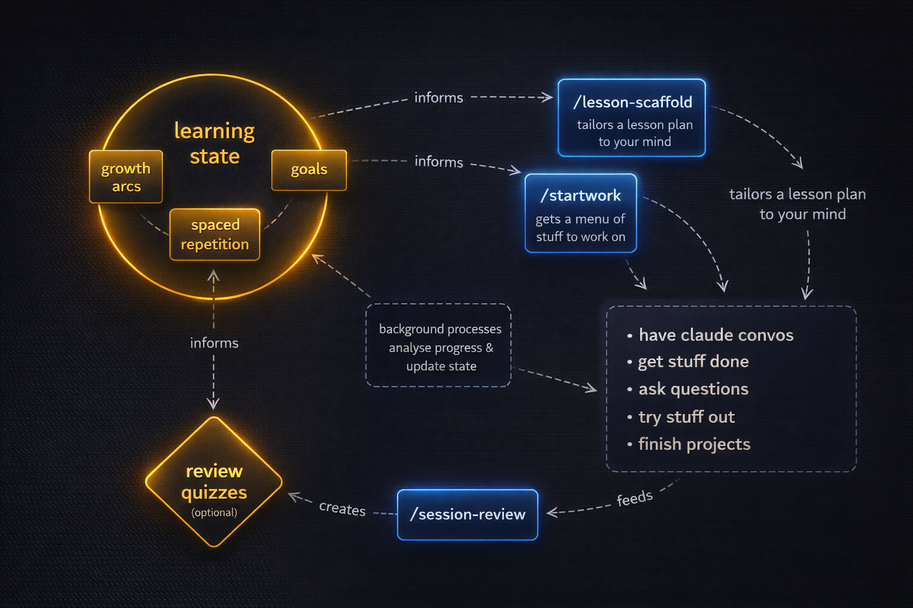

# Weft

A **Claude Code augmenter** that learns how you learn in order to teach you better over time. Drop some materials, run a ~30-minute interview, and get a memory+skill system that tracks your growth and adapts to where you are right now. It sharpens itself every time you use it.

### Don't have Claude Code yet?

Paste this into a [Claude](https://claude.ai) conversation:

```
I want to set up Claude Code and a personal learning harness called Weft.
I'm starting from Claude in the browser. Please read the setup guide at
https://github.com/hartphoenix/weft and walk me through the full
installation, one step at a time.
```

Claude will walk you through installing prerequisites and Claude Code,
then hand you a prompt to paste once you're in a terminal.

## Prerequisites

- [Claude Code](https://docs.anthropic.com/en/docs/claude-code) installed and working
- [GitHub CLI (`gh`)](https://cli.github.com/) installed and authenticated
  ([quickstart](https://docs.github.com/en/github-cli/github-cli/quickstart))
- [`jq`](https://jqlang.github.io/jq/download/) — used by the installer
- `git`

Tested on macOS. Linux should work. Windows: use WSL.

## Install

```bash
git clone https://github.com/hartphoenix/weft ~/weft
cd ~/weft && bash scripts/bootstrap.sh
```

You can clone anywhere — bootstrap resolves paths from wherever you
run it. `~/weft` is the recommended default.

Bootstrap registers skills globally, sets up a session-start hook,
writes a path-resolution section to `~/.claude/CLAUDE.md`, and creates
a config directory at `~/.config/weft/`. Everything is reversible with
`bash scripts/uninstall.sh`.

## Quick start

### 1. (Optional) Load your background

Drop files into `~/weft/background/` before running intake — code
you've written, resumes, writing samples, conversation exports, course
materials. The more signal you provide, the sharper your starting
profile. Optional — if you skip it, the interview covers everything.

### 2. Run intake

Start Claude Code in **any project directory** and run:

```
/intake
```

Intake scans your background materials, runs a ~30-minute
conversational interview, generates your personalized configuration,
and presents everything for approval before writing any files.

### 3. Get oriented

Run the getting-started guide through lesson-scaffold — it adapts the
walkthrough to your intake profile:

```
/lesson-scaffold guides/getting-started.md
```

After that, use Claude Code normally in any project. The harness works
in the background — see **The learning loop** below.

## The learning loop

The harness improves your profile every time you use it.

1. **Work** — use Claude Code normally in any project.
2. **Update** — your learning state stays current through two paths:
   - **Active:** run `/session-review` at the end of a session. It
     analyzes what you did, quizzes you on 4-6 concepts, and updates
     your scores.
   - **Passive:** `/startwork` and the session-start hook automatically
     trigger `/session-digest` when enough sessions have accumulated.
     Digest reads your transcripts, extracts evidence, and proposes
     score updates — no quiz required. You approve or skip each change.
3. **Plan** — `/startwork` reads your updated state and proposes what
   to focus on. It runs automatically at session start, or invoke it
   directly.
4. **Reflect** — after 3+ sessions, `/startwork` dispatches
   `/progress-review` to detect cross-session patterns: stalls,
   regressions, goal drift, arc readiness.

Scores are quiz-verified or evidence-observed, never self-reported —
the profile converges on reality over time.

## Skills

All skills are invoked with `/skill-name` in Claude Code.

### Core loop

| Skill | What it does |
|-------|-------------|
| **/intake** | Onboarding interview — bootstraps your profile from background materials and conversation |
| **/startwork** | Session planner — reads git status, learning state, schedule, and project context to propose a time-budgeted plan |
| **/session-review** | End-of-session analysis, quiz, and learning state update |
| **/session-digest** | Lightweight learning-state diff from session evidence — no quiz required. You approve or skip each proposed change |
| **/progress-review** | Cross-session pattern analysis — detects stalls, regressions, and goal drift |

### Working tools

| Skill | What it does |
|-------|-------------|
| **/lesson-scaffold** | Restructures learning materials (URL, file, or pasted text) into a conceptual scaffold shaped to your current level |
| **/quick-ref** | Direct, concise answers to factual and structural questions. Flags the bigger picture in one sentence when relevant |
| **/debugger** | Guides debugging when something breaks — collects full error context, prompts for hypotheses, rescopes when stuck |
| **/safety-help** | Audits your Claude Code security configuration against the [Safer YOLO guide](guides/safer-yolo-mode.md). Checks sandbox, deny rules, hooks, and secret scanning, then reports findings in plain language with recommendations customized to your setup |
| **/handoff-test** | Audits session artifacts for self-containedness before context is lost. Identifies what the artifact assumes but doesn't say |
| **/handoff-prompt** | Generates a handoff prompt for the next agent when context is running low |
| **/git-ship** | Full git workflow in one command — stage, commit, push, and PR. `--merge` to squash-merge, `--dry-run` to preview |
| **/persist** | Saves the current plan to `plans/` with a descriptive name. Use after plan approval or before context runs low |
| **/skill-sharpen** | Guides toward token-efficient, behaviorally precise prose when editing SKILL.md files or agent-facing instruction documents |

### Automatic dispatch

Some skills run automatically:

- **/startwork** dispatches **/session-digest** when 3+ sessions are
  undigested, and **/progress-review** when 3+ sessions have
  accumulated since the last review.
- The **session-start hook** checks your state at session start. It
  suggests `/intake` if you haven't onboarded, `/startwork` if you've
  been away, and `/session-digest` if your profile hasn't updated in
  a few days (configurable — see **Settings** below).
- **/session-discovery** is infrastructure — it finds prior sessions
  on your machine. Other skills use it to gather evidence.

### Contextual activation

These skills activate based on what you're doing — no slash command
needed, though you can also invoke them directly:

- **/quick-ref** and **/debugger** — when you ask a factual question
  or hit an error.
- **/skill-sharpen** — when you're editing skill files or agent-facing
  instructions.
- **/safety-help** — when you mention YOLO mode, bypass permissions,
  or security configuration. It offers to run an audit rather than
  launching one automatically.

## Everything is editable

Every generated file is plain markdown. Edit `~/.claude/CLAUDE.md` to
change behavior, `learning/current-state.md` to correct a score. The
system reads what's there — if you change it, it adapts.

## Privacy

Your learning profile stays on your machine:

- `background/` and `learning/` are gitignored out of the box
- Nothing leaves your machine without your explicit action

## Update

```bash
cd ~/weft && git pull
```

Skills update immediately — they're loaded from the clone directory.
Learning state (`~/weft/learning/`) is gitignored and never overwritten.
With `"updates": "notify"` (default), the harness tells you when
updates are available.

## Safety

Run `/safety-help` to audit your Claude Code security configuration
against the [Safer YOLO guide](guides/safer-yolo-mode.md). It checks
sandbox isolation, deny rules, hooks, and secret scanning, then gives
you a plain-language report with recommendations customized to your
setup. Works in both bypass mode and default permission mode.

For the full security research and threat model, see the
[companion article](https://gist.github.com/hartphoenix/698eb8ef8b08ad2ce6a99cf7346cd7cc).

## What intake creates

| File | Purpose |
|------|---------|
| `~/.claude/CLAUDE.md` | Personalized configuration (written within `<!-- weft -->` markers, won't overwrite your other content) |
| `learning/goals.md` | Your aspirations as states of being, not skill checklists |
| `learning/arcs.md` | Capability clusters — groups of skills serving your goals |
| `learning/current-state.md` | Concept inventory — scores, gap types, evidence sources |

After sessions, `/session-review` also creates session logs in
`learning/session-logs/`.

## Settings

Preferences live in `~/.config/weft/config.json`. You can edit the
file directly or ask Claude to adjust your Weft settings.

| Key | Values | Default | What it controls |
|-----|--------|---------|-----------------|
| `updates` | `"notify"` \| `"auto"` \| `"off"` | `"notify"` | Harness update check at session start |
| `digestInterval` | positive integer (days) | `3` | How often the hook suggests running `/session-digest` |
| `digestMode` | `"suggest"` \| `"off"` | `"suggest"` | Whether the hook nudges for digest at all |

All keys are optional — missing keys use their defaults. Digest
preferences are configured during `/intake`.

## Under the hood

Files created by skills during normal use. You don't need to touch
them, but they're useful for debugging or customizing.

| File | Created by | Purpose |
|------|-----------|---------|
| `learning/session-logs/YYYY-MM-DD.md` | session-review | One file per reviewed session. YAML frontmatter + markdown body. |
| `learning/scaffolds/` | lesson-scaffold | Restructured learning materials with concept classifications |
| `learning/.intake-notes.md` | intake | Resume checkpoint if intake is interrupted mid-interview |
| `learning/.last-digest-timestamp` | intake / session-digest | Date of last digest — controls the discovery window. Seeded by intake so the first session doesn't nudge immediately |
| `learning/.progress-review-log.md` | progress-review | Tracks review windows and deferred findings |

### Session-start hook

When you open Claude Code, a hook runs automatically. It checks:

- Whether you've run `/intake` yet (suggests it if not)
- Whether a previous `/intake` was interrupted (offers to resume)
- Whether your learning profile is stale (suggests `/startwork`)
- Whether your profile needs a digest update (suggests `/session-digest`)
- Whether new skills need linking (suggests re-running bootstrap)
- Whether harness updates are available (if `"updates": "notify"`)

## Uninstall

```bash
bash ~/weft/scripts/uninstall.sh
```

Removes the settings.json entries, the CLAUDE.md section, and the
config directory. Learning state is preserved — you're told where it
is and can delete it manually.

## Troubleshooting

**Intake interrupted mid-interview:** Run `/intake` again. It detects
the interrupted state and offers to resume where you left off.

**Skills not activating:** Run `bash ~/weft/scripts/bootstrap.sh`
to re-register. Bootstrap is idempotent — safe to run multiple times.

**Session-review says no learning state:** Run `/intake` first. The
review needs the profile that intake creates.

**Digest nudge too frequent or unwanted:** Check `digestInterval` and
`digestMode` in `~/.config/weft/config.json`. Set `"digestMode": "off"`
to disable, or raise the interval. If the nudge fires every session,
`learning/.last-digest-timestamp` may be missing.

**Update check not working:** Verify your weft directory is a git
repo with a remote: `cd ~/weft && git remote -v`. The hook fetches
in the background — it won't block your session.

---

## Setup guide — for Claude

If a user has pointed you here and asked for help setting up Weft, guide
them through these four steps. Check in after each step before moving on,
and adapt your instructions to their operating system and what they already
have installed.

**Step 1 — Prerequisites**

They need these four tools:
- Node.js 18 or higher
- GitHub CLI (`gh`), authenticated to their GitHub account
- `jq` (a JSON command-line tool)
- `git`

**Step 2 — Install Claude Code**

Once prerequisites are in place:

```
npm install -g @anthropic-ai/claude-code
```

**Step 3 — Authenticate Claude Code**

Run `claude` in the terminal for the first time and follow the prompts to
connect to their Anthropic account.

**Step 4 — Hand off to Claude Code**

Once `claude` is running and they're in a terminal session, tell them to
paste this prompt:

```
Please install the Weft learning harness on this machine. Run these commands:

git clone https://github.com/hartphoenix/weft ~/weft
cd ~/weft && bash scripts/bootstrap.sh

The bootstrap script will register Weft's skills globally and set up a
session-start hook. It needs these tools already installed: gh
(authenticated), jq, and git. If any are missing, stop and let me know
before proceeding.

Once bootstrap completes, let me know what was installed and prompt me to
run /intake to begin my personalized setup.
```

Start by asking what operating system they're on.
