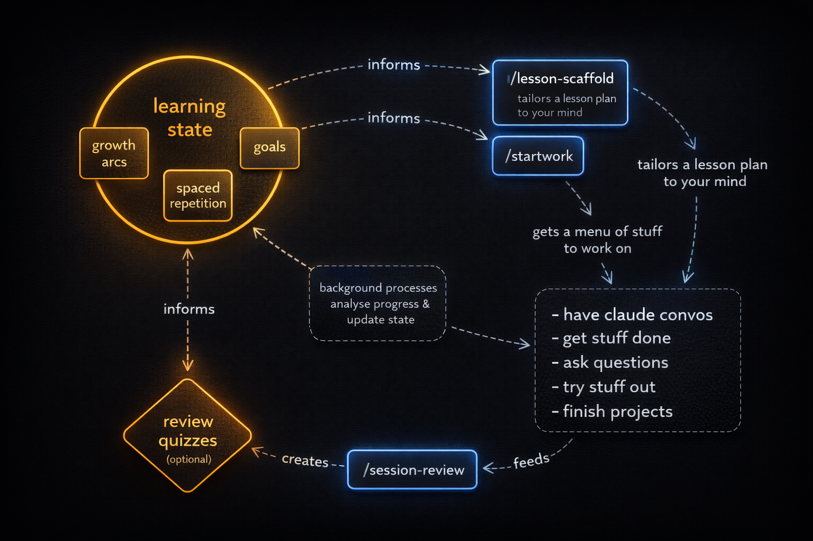

# The Weft Harness
## Don't have Claude Code yet?

If you're starting from scratch, use Claude in the browser to get set up.
Paste this into a Claude conversation:

```
I want to set up Claude Code and a personal learning harness called Weft.
I'm starting from Claude in the browser. Please read the setup guide at
https://github.com/hartphoenix/weft and walk me through the full
installation, one step at a time.
```

Claude will read this README, guide you through installing prerequisites
and Claude Code, then hand you a short prompt to paste once you're in a
terminal session.

---

Weft is a personal development harness for Claude Code. It learns how you learn,
keeps up with your progress, and adapts its behavior to where you are right now.

Drop some materials, run a ~30-minute interview, and get a system that
sharpens itself every time you use it.

It's not designed to remember *facts* about you per se. It's designed to understand the way you learn and use that to boost your growth.

## Prerequisites

- [Claude Code](https://docs.anthropic.com/en/docs/claude-code) installed and working
- [GitHub CLI (`gh`)](https://cli.github.com/) installed and authenticated — used
  for usage signals. Run `gh auth status` to check. If you need to set it up:
  [GitHub CLI quickstart](https://docs.github.com/en/github-cli/github-cli/quickstart)
- [`jq`](https://jqlang.github.io/jq/download/) — used by the installer for safe JSON manipulation
- `git` — you probably already have this

Tested on macOS. Linux should work — all scripts use portable bash
and POSIX utilities. Windows users: use WSL.

## Install

```bash
git clone https://github.com/hartphoenix/weft ~/weft
cd ~/weft && bash scripts/bootstrap.sh
```

You can clone anywhere — the bootstrap script above resolves paths from wherever you
run it. `~/weft` is the recommended default, and this README uses it
in all examples.

Bootstrap does four things:
1. Registers skills globally so they're available in any project
2. Registers a session-start hook that checks your learning state
3. Writes a path-resolution section to `~/.claude/CLAUDE.md`
4. Creates a config directory (`~/.config/weft/`) with update and digest preferences

During installation, everything is tracked in a manifest (`~/.config/weft/manifest.json`)
and backed up. You can run `bash scripts/uninstall.sh` to reverse it cleanly.

## Quick start

### 1. (Optional) Load up your background data

Drop files into `~/weft/background/` before running intake. The more
signal you provide, the sharper your starting profile:

- **Code you've written** — shows what you can build and how you think
- **Resumes or portfolios** — background, experience, trajectory
- **Writing samples** — communication style, how you explain things
- **Conversation exports** — past Claude/ChatGPT transcripts that show
  your working patterns
- **Course materials** — syllabi, assignments, lecture notes for what
  you're currently learning

The background folder is optional. If you skip it, the interview covers
everything — it just takes a few more questions.

### 2. Run intake

Start Claude Code in **any project directory** and run:

```
/intake
```

The intake interview has four phases:

1. **Discover** — scans your background materials (if any) to build a
   starting profile
2. **Interview** — conversational, ~30 minutes. Covers your
   background, goals, current skills, how you learn, and how you like
   to work
3. **Synthesize** — generates your personalized configuration and
   learning state
4. **Write** — presents everything for your approval before writing
   any files

Nothing is written without your explicit OK.

### 3. Start working

After intake, use Claude Code normally in any project. The harness works
in the background. See **The learning loop** below.

To get oriented to the harness tools, run the getting-started guide through
lesson-scaffold — it adapts the lesson to your intake profile. You may want
to `/clear` first to start a fresh session:

```
/lesson-scaffold guides/getting-started.md
```

## The learning loop



The harness improves your profile every time you use it. It runs on
two parallel update paths — active and passive — and they reinforce each other.

1. **Work** — use Claude Code normally in any project.
    - Optionally, use `/startwork` to get a menu of tasks to choose from. Whatever you provide in your background info – projects, scheduled deadlines, goals – inform Weft's gathering process. 
2. **Update** — your learning state updates through either path:
   - **Active:** run `/session-review` when you finish a session. It
     analyzes what you did and quizzes you on ~5 relevant concepts, helping you lock in memories. It also updates the record of your progress and hones Weft's model of you for the next session.
    - **Passive:** background processes designed to be low-friction will periodically assess how the learning's going and offer to update your learning model. It's always up to you whether to accept changes.
3. **Plan** — next time you start working, `/startwork` reads your
   updated state and proposes what to focus on. It runs automatically
   at session start via the hook, or invoke it directly.
4. **Reflect** — after 3+ sessions, `/startwork` automatically
   dispatches `/progress-review` to detect cross-session patterns:
   stalls, regressions, goal drift, arc readiness. You can also run
   `/progress-review` directly anytime.

The more sessions you complete, the sharper the system gets. Concept
scores are either quiz-verified or evidence-observed, never
self-reported — so the profile converges on reality.

## Privacy

Your learning profile stays local by default:

- `background/` and `learning/` are gitignored out of the box
- During intake, you choose whether your `~/.claude/CLAUDE.md` content is shared or private
- Nothing leaves your machine without your explicit action

## What intake creates

| File | Purpose |
|------|---------|
| `~/.claude/CLAUDE.md` | Personalized configuration (written within `<!-- weft -->` markers, won't overwrite your other content) |
| `learning/goals.md` | Your aspirations as states of being, not skill checklists |
| `learning/arcs.md` | Capability clusters — groups of skills serving your goals |
| `learning/current-state.md` | Concept inventory — scores, gap types, evidence sources |

After sessions, `/session-review` also creates session logs in
`learning/session-logs/`.

## Skills

All skills are invoked with `/skill-name` in Claude Code.

### Core loop

| Skill | What it does |
|-------|-------------|
| **/intake** | Onboarding interview — bootstraps your profile from background materials and conversation |
| **/startwork** | Session planner — reads git status, learning state, schedule, and project context to propose a time-budgeted plan |
| **/session-review** | End-of-session analysis, quiz, and learning state update |
| **/session-digest** | Lightweight learning-state diff from session evidence — no quiz, no file writes. Callers handle approval |
| **/progress-review** | Cross-session pattern analysis — detects stalls, regressions, and goal drift |

### Working tools

| Skill | What it does |
|-------|-------------|
| **/lesson-scaffold** | Restructures learning materials (URL, file, or pasted text) into a conceptual scaffold shaped to your current level |
| **/quick-ref** | Direct, concise answers to factual and structural questions. Flags the bigger picture in one sentence when relevant |
| **/debugger** | Guides debugging when something breaks — collects full error context, prompts for hypotheses, rescopes when stuck |
| **/handoff-test** | Audits session artifacts for self-containedness before context is lost. Identifies what the artifact assumes but doesn't say |
| **/handoff-prompt** | Generates a handoff prompt for the next agent when context is running low |
| **/git-ship** | Full git workflow in one command — stage, commit, push, and PR. `--merge` to squash-merge, `--dry-run` to preview |
| **/persist** | Saves the current plan to `plans/` with a descriptive name. Use after plan approval or before compaction |
| **/skill-sharpen** | Guides toward token-efficient, behaviorally precise prose when editing SKILL.md files or agent-facing instruction documents |

### Automatic dispatch

Some skills run automatically without you invoking them:

- **/startwork** dispatches **/session-digest** when 3+ sessions are
  undigested, updating your learning state from transcript evidence.
- **/startwork** dispatches **/progress-review** when 3+ sessions have
  accumulated since the last review, but you can also run it yourself.
- The **session-start hook** checks your learning state at session
  start. It suggests `/intake` if you haven't onboarded, `/startwork`
  if you've been away, and `/session-digest` if your profile hasn't
  been updated in a few days (configurable — see **Settings** below).
  Existing users who haven't configured digest yet get a one-time
  introduction.
- **/session-discovery** is infrastructure — it finds prior Claude Code
  sessions on your machine. You never invoke it directly; other skills
  (session-review, session-digest, startwork, progress-review) use it
  to gather evidence.
- **/quick-ref** and **/debugger** activate contextually based on what
  you're doing — no slash command needed.
- **/skill-sharpen** activates contextually when you're editing skill
  files.

## Everything is editable

The intake gives you a starting point, not a lock-in. Every generated
file is plain markdown. Edit `~/.claude/CLAUDE.md` to change how the system
behaves. Edit `learning/current-state.md` to correct a score. The
system reads what's there — if you change it, it adapts.

## Settings

Preferences live in `~/.config/weft/config.json`. You can edit the
file directly or ask Claude to adjust your Weft settings.

| Key | Values | Default | What it controls |
|-----|--------|---------|-----------------|
| `updates` | `"notify"` \| `"auto"` \| `"off"` | `"notify"` | Harness update check at session start |
| `digestInterval` | positive integer (days) | `3` | How often the hook suggests running `/session-digest` |
| `digestMode` | `"suggest"` \| `"off"` | `"suggest"` | Whether the hook nudges for digest at all |

All keys are optional — missing keys use their defaults. New users
configure digest preferences during `/intake`. Existing users are
prompted once at session start to set their preference.

## Update

```bash
cd ~/weft && git pull
```

Skills update immediately — they're loaded from the clone directory,
so a pull is all it takes. Learning state (`~/weft/learning/`) is
never overwritten by pull — it's gitignored.

If you set `"updates": "notify"` (default), the harness tells you when
updates are available at session start.

## Recommended: Install a command guard

AI coding agents occasionally attempt destructive commands (`git reset
--hard`, `rm -rf`, force pushes). [DCG (Destructive Command Guard)](https://github.com/Dicklesworthstone/destructive_command_guard)
intercepts these before execution. Install it once and it protects all
your projects — see the [DCG README](https://github.com/Dicklesworthstone/destructive_command_guard?tab=readme-ov-file#dcg-destructive-command-guard)
for setup instructions.

## Data sharing (optional)

During `/intake`, you'll be asked if you want to share learning data
to GitHub. If you opt in:

**Developer signals** — at the end of each `/session-review`, a short
signal is posted to the developer's repo (`hartphoenix/weft-signals`)
with your feedback on how the tool worked, plus learning metrics
(concept scores, gap types, progress patterns). This data helps improve
the harness — it's how bugs get found and skills get sharpened. You see
every signal before it sends and approve or skip each one.

**Progress repo** — a public GitHub repo is created on your account
(`your-username/learning-signals`). When you run `/progress-review`,
a summary posts there. Teachers, mentors, or peers can watch the repo
and comment with guidance.

**What's shared:** concept scores, gap types, progress patterns, goals,
and growth edges.
**What's never shared:** conversation content, code, file paths,
background materials, or raw quiz answers.

**Current status:** Signal dispatch (you → developer) works now.
The teacher response loop (teacher comments → surfaced in your next
`/startwork`) is designed and coming in a future update. For now,
teacher feedback works through normal GitHub issue comments — you'll
see it when you check your progress repo.

**To invite a teacher:** send them your progress repo link. They Watch
it on GitHub. Add their GitHub handle to `learning/relationships.md`
and `/progress-review` will assign issues to them automatically.

To opt out of all data sharing, delete `~/weft/.claude/consent.json`.

## Under the hood

These files are created and managed by skills during normal use.
You don't need to touch them, but knowing they exist helps if you're
debugging or customizing.

| File | Created by | Purpose |
|------|-----------|---------|
| `learning/session-logs/YYYY-MM-DD.md` | session-review | One file per reviewed session. YAML frontmatter + markdown body. |
| `learning/scaffolds/` | lesson-scaffold | Restructured learning materials with concept classifications |
| `learning/relationships.md` | intake (if opted in) | Teacher/mentor handles and signal repo config |
| `learning/.intake-notes.md` | intake | Resume checkpoint if intake is interrupted mid-interview |
| `learning/.last-digest-timestamp` | intake / session-digest | Date of last digest — controls the discovery window. Seeded by intake so the first session doesn't nudge immediately |
| `learning/.progress-review-log.md` | progress-review | Tracks review windows and deferred findings |

### Session-start hook

When you open Claude Code, a hook runs automatically. It checks:

- Whether you've run `/intake` yet (suggests it if not)
- Whether a previous `/intake` was interrupted (offers to resume)
- Whether your learning profile is stale (suggests `/startwork`)
- Whether your profile needs a digest update (suggests `/session-digest`)
- Whether new skills need linking (suggests re-running bootstrap)
- Whether harness updates are available (if `"updates": "notify"`)

## Uninstall

```bash
bash ~/weft/scripts/uninstall.sh
```

Removes the settings.json entries, the CLAUDE.md section, and the
config directory. Learning state is preserved — you're told where it
is and can delete it manually.

## Troubleshooting

**Intake interrupted mid-interview:** Run `/intake` again. It detects
the interrupted state and offers to resume where you left off.

**Skills not activating:** Run `bash ~/weft/scripts/bootstrap.sh`
to re-register. Bootstrap is idempotent — safe to run multiple times.

**Session-review says no learning state:** Run `/intake` first. The
review needs the profile that intake creates.

**Digest nudge appearing every session:** Your `digestInterval` may be
set too low, or `learning/.last-digest-timestamp` is missing. Check
`~/.config/weft/config.json` and verify the timestamp file exists in
your learning directory.

**Want to disable the digest nudge:** Set `"digestMode": "off"` in
`~/.config/weft/config.json`, or ask Claude to turn off digest
suggestions.

**Update check not working:** Verify your weft directory is a git
repo with a remote: `cd ~/weft && git remote -v`. The hook fetches
in the background — it won't block your session.

---

## Setup guide — for Claude

If a user has pointed you here and asked for help setting up Weft, guide
them through these four steps. Check in after each step before moving on,
and adapt your instructions to their operating system and what they already
have installed.

**Step 1 — Prerequisites**

They need these four tools:
- Node.js 18 or higher
- GitHub CLI (`gh`), authenticated to their GitHub account
- `jq` (a JSON command-line tool)
- `git`

**Step 2 — Install Claude Code**

Once prerequisites are in place:

```
npm install -g @anthropic-ai/claude-code
```

**Step 3 — Authenticate Claude Code**

Run `claude` in the terminal for the first time and follow the prompts to
connect to their Anthropic account.

**Step 4 — Hand off to Claude Code**

Once `claude` is running and they're in a terminal session, tell them to
paste this prompt:

```
Please install the Weft learning harness on this machine. Run these commands:

git clone https://github.com/hartphoenix/weft ~/weft
cd ~/weft && bash scripts/bootstrap.sh

The bootstrap script will register Weft's skills globally and set up a
session-start hook. It needs these tools already installed: gh
(authenticated), jq, and git. If any are missing, stop and let me know
before proceeding.

Once bootstrap completes, let me know what was installed and prompt me to
run /intake to begin my personalized setup.
```

Start by asking what operating system they're on.
